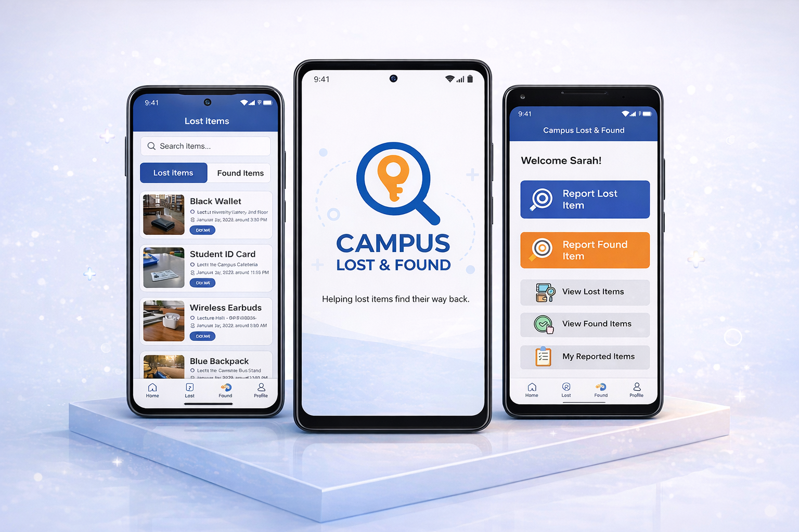

# 🎒 Campus Lost & Found App

A **modern mobile application built with Flutter and Firebase** designed to help students **report, search, and recover lost items** on campus efficiently. The app uses **AI-powered image recognition** and smart matching to maximize recovery chances and streamline communication between finders and owners.

---

## 📸 App Preview

  

---

## ✨ Key Features

- 🔐 **Secure Authentication** – Register, login, and password recovery  
- 🆕 **Lost & Found Reporting** – Submit detailed item reports with images  
- 📄 **Item Listings** – Browse lost and found items with real-time updates  
- 🤖 **AI Item Recognition** – Upload photos and get smart matching suggestions  
- 📞 **Claim & Contact** – Directly contact item owners or finders  
- 🚚 **Delivery Arrangement** – Coordinate safe item handover  
- 📊 **Personal Reports** – Track your submissions and claims history  
- 🎨 **Modern UI/UX** – Clean, responsive design for mobile devices  

---

## 🗂️ Project Structure

```text
campus-lost-found-app/
│
├── assets/
│   ├── images/             # Logos, placeholders, empty states
│   ├── icons/              # Lost, found, and profile icons
│   └── animations/         # Lottie loading animations
│
├── lib/
│   ├── main.dart           # App entry point
│   ├── core/               # Constants, services, utils, themes
│   ├── models/             # Data models for users, items, claims
│   ├── repositories/       # Data access layers
│   ├── features/           # App features split by module
│   │   ├── authentication/ # Login, register, verification flows
│   │   ├── home/           # Home screen
│   │   ├── lost_items/     # Lost item management
│   │   ├── found_items/    # Found item management
│   │   ├── ai_features/    # AI detection, matching, and image generation
│   │   ├── claim_item/     # Claim and contact workflows
│   │   ├── delivery/       # Delivery arrangement screens
│   │   ├── reports/        # User reports tracking
│   │   └── profile/        # Profile management
│   ├── widgets/            # Reusable UI components
│   └── routes/             # App navigation routes
│
├── android/                # Android native files
├── ios/                    # iOS native files
├── web/                    # Web deployment (optional)
├── test/                   # Unit & widget tests
├── pubspec.yaml            # Flutter dependencies
├── README.md               # Project documentation
└── .gitignore              # Git ignores
