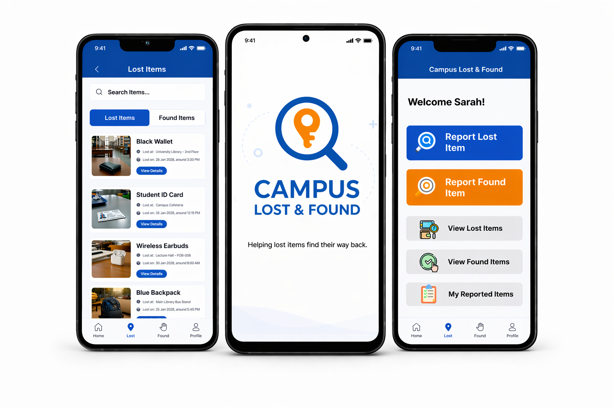

# 🎒 Campus Lost & Found App

A **modern mobile application built with Flutter and Firebase** designed to help students **report, search, and recover lost items** on campus efficiently. The app uses **AI-powered image recognition** and smart matching to maximize recovery chances and streamline communication between finders and owners.

---

## 📸 App Preview

  

---

## ✨ Key Features

- 🔐 **Secure Authentication** – Register, login, and password recovery  
- 🆕 **Lost & Found Reporting** – Submit detailed item reports with images  
- 📄 **Item Listings** – Browse lost and found items with real-time updates  
- 🤖 **AI Item Recognition** – Upload photos and get smart matching suggestions  
- 📞 **Claim & Contact** – Directly contact item owners or finders  
- 🚚 **Delivery Arrangement** – Coordinate safe item handover  
- 📊 **Personal Reports** – Track your submissions and claims history  
- 🎨 **Modern UI/UX** – Clean, responsive design for mobile devices  

---

## 🗂️ Project Structure

```text
campus_lost_found_app/
│
├── pubspec.yaml                     # Dependencies & project metadata
├── pubspec.lock                     # Locked dependency versions
├── analysis_options.yaml            # Dart analysis configuration
├── firebase.json                    # Firebase configuration
├── .firebaserc                      # Firebase project reference
├── .metadata                        # Flutter metadata
├── .gitignore
├── README.md
│
├── lib/                             # Dart application code
│   ├── main.dart                    # App entry point
│   ├── firebase_options.dart        # Firebase initialization config
│   │
│   ├── routes/
│   │   └── app_routes.dart          # Centralized route management
│   │
│   ├── core/                        # Core services & shared logic
│   │   └── services/
│   │       ├── app_settings.dart
│   │       ├── auth_service.dart
│   │       ├── fcm_service.dart
│   │       ├── firestore_notification_listener.dart
│   │       └── notification_service.dart
│   │
│   ├── widgets/                     # Reusable global UI components
│   │   ├── custom_button.dart
│   │   └── navigation_bar.dart
│   │
│   └── features/                    # Feature-based modular structure
│       │
│       ├── authentication/
│       │   ├── screens/
│       │   │   ├── splash_screen.dart
│       │   │   ├── login_screen.dart
│       │   │   ├── register_screen.dart
│       │   │   ├── forgot_password_screen.dart
│       │   │   └── profile_picture_screen.dart
│       │   └── widgets/
│       │       ├── auth_header.dart
│       │       ├── auth_textfield.dart
│       │       └── profile_picker.dart
│       │
│       ├── home/
│       │   └── screens/
│       │       └── home_screen.dart
│       │
│       ├── found_items/
│       │   └── screens/
│       │       ├── found_items_list_screen.dart
│       │       ├── found_item_details_screen.dart
│       │       ├── report_found_item_screen.dart
│       │       └── found_item_report_submit.dart
│       │
│       ├── lost_items/
│       │   └── screens/
│       │       ├── lost_items_list_screen.dart
│       │       ├── lost_item_details_screen.dart
│       │       ├── report_lost_item_screen.dart
│       │       └── lost_item_report_submit.dart
│       │
│       ├── ai_features/
│       │   ├── screens/
│       │   │   ├── found_ai_image_generator_screen.dart
│       │   │   ├── found_ai_generated_image_screen.dart
│       │   │   ├── found_image_picker.dart
│       │   │   ├── found_select_category_page.dart
│       │   │   ├── found_selected_successfully.dart
│       │   │   ├── found_deleted_successfully.dart
│       │   │   ├── lost_ai_image_generator_screen.dart
│       │   │   ├── lost_ai_generated_image_screen.dart
│       │   │   ├── lost_image_picker.dart
│       │   │   ├── lost_select_category_page.dart
│       │   │   ├── lost_selected_successfully.dart
│       │   │   └── lost_deleted_successfully.dart
│       │   └── services/
│       │       └── ai_image_service.dart
│       │
│       ├── claim_item/
│       │   └── screens/
│       │       ├── contact_owner_screen.dart
│       │       └── contact_founder_screen.dart
│       │
│       ├── delivery/
│       │   └── screens/
│       │       ├── found_item_delivery_confirmation_screen.dart
│       │       └── lost_item_delivery_confirmation_screen.dart
│       │
│       ├── profile/
│       │   └── screens/
│       │       └── profile_screen.dart
│       │
│       └── reports/
│           └── screens/
│               ├── my_reports_found_item_screen.dart
│               └── my_reports_lost_item_screen.dart
│
├── android/                         # Android platform code
├── ios/                             # iOS platform code
├── web/                             # Web platform code
├── linux/                           # Linux platform code
├── macos/                           # macOS platform code
├── windows/                         # Windows platform code
│
├── assets/
│   └── images/                      # App images & assets
│
└── test/                            # Unit & widget tests
```
